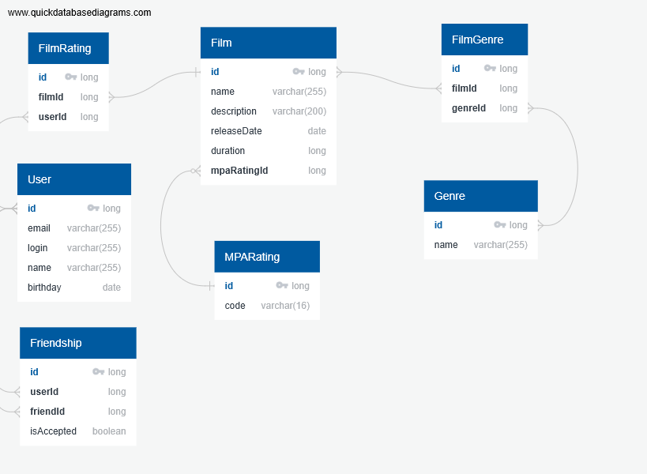

# java-filmorate
## Сущлности базы данных
### ER-диаграмма

### Выборка всех клиентов
```
select *
from
    user
```
### Выборка всех фильмов
```
select *
from
    film
```
### Выборка n самых популярных фильмов по рейтингу
```
select *
from
    film f
where
    f.id in (select fr.filmId
             from 
                    FilmRating fr
             group by 
                    fr.filmId
             order by
                    count(fr.filmId)
             limit n)
```